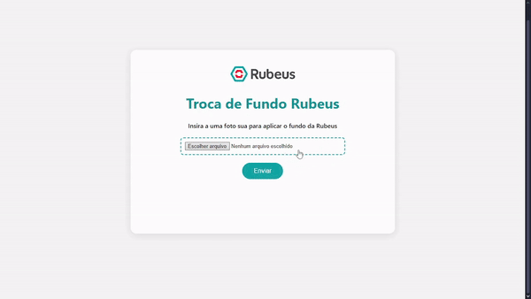

<h1 align="center">Troca de Fundo Rubeus</h1>

<p align="center">
  
</p>

<p>A aplicação de Troca de Fundo Rubeus foi desenvolvida para ajudar novos membros da Rubeus a enviarem sua foto com um fundo personalizado contendo a logo da empresa. O projeto permite que o fundo original da imagem seja removido e substituído automaticamente por um background oficial da Rubeus, garantindo uma identidade visual padronizada e profissional. Essa ferramenta foi desenvolvida visando facilitar a integração e melhorar a experiência de novos colaboradores. </p>

## Funcionalidades

- 🖼️ Remove automaticamente o fundo de qualquer imagem carregada, utilizando a API do **RemoveBG**.
- 🎨 Substitui o fundo removido por um background oficial da Rubeus.
- 🔁 Alterna entre 12 chaves da API automaticamente para evitar interrupções quando o limite de tokens de uma chave é atingido. Com isso, é possível processar até 600 tokens atualizados mensalmente antes de todas as chaves serem esgotadas.
- 📂 Permite o upload de arquivos diretamente pelo navegador.
- 💾 Download da imagem processada com o novo fundo.

## Tecnologias
- HTML
- CSS
- JavaScript 

## Acesse o projeto
Você pode executar o Rubeus Background Swap diretamente pelos links do: [github](https://tarcisiobm.github.io/BackgroundSwap/) | [vercel](https://background-swap.vercel.app) ou  fazer o clone deste repositório para para executar a aplicação localmente em sua máquina.

## Como Rodar Localmente

1. Clone o repositório:
   ```bash
   git clone https://github.com/tarcisiobm/BackgroundSwap.git
   ```
2. Navegue até o diretório do projeto:
   ```bash
   cd BackgroundSwap
   ```
## Contato
📧 tarcisiobm.dev@gmail.com  
📞 +55 (32) 98488-5764
